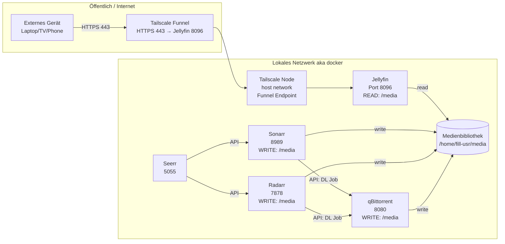

---

---
Openssh
```
sudo apt update
sudo apt install openssh-server
sudo systemctl enable --now ssh
sudo systemctl restart ssh
ip -4 addr show
#connect: ssh user@ip
```
SSH:
```
curl -sSL https://raw.githubusercontent.com/florianthepro/jellyfin-enhanced-setup/main/ssh.sh | sudo bash
```
Reset:
```
curl -sSL https://raw.githubusercontent.com/florianthepro/jellyfin-enhanced-setup/main/reset.sh | sudo bash
```
Install:
```
curl -sSL https://raw.githubusercontent.com/florianthepro/jellyfin-enhanced-setup/main/install.sh | bash
```
Setup:
```
curl -sSL https://raw.githubusercontent.com/florianthepro/jellyfin-enhanced-setup/main/setup.sh | bash
```
<!--
mkdir -p ~/media/video/series-a/season00/s01E01.mkv & mkdir -p ~/media/video/movie-name/data like mp3 mkv etc
sudo tailscale funnel 8096 on
sudo tailscale funnel on 8096
-->
---
