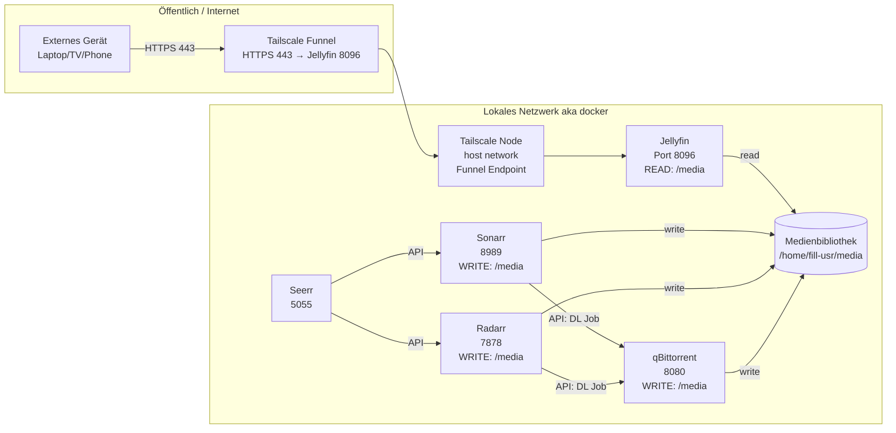

---

---
Openssh
```
sudo apt update
sudo apt install openssh-server
sudo systemctl enable --now ssh
sudo systemctl restart ssh
ip -4 addr show
#connect: ssh user@ip
```
SSH:
```
curl -sSL https://raw.githubusercontent.com/florianthepro/jellyfin-enhanced-setup/main/ssh.sh | sudo bash
```
Reset:
```
curl -sSL https://raw.githubusercontent.com/florianthepro/jellyfin-enhanced-setup/main/reset.sh | sudo bash
```
Install:
```
curl -sSL https://raw.githubusercontent.com/florianthepro/jellyfin-enhanced-setup/main/install.sh | bash
```
Setup:
```
curl -sSL https://raw.githubusercontent.com/florianthepro/jellyfin-enhanced-setup/main/setup.sh | bash
```
<!--
mkdir -p ~/media/video/series-a/season00/s01E01.mkv & mkdir -p ~/media/video/movie-name/data like mp3 mkv etc
sudo tailscale funnel 8096 on
sudo tailscale funnel on 8096
-->
---
# ziel:
1. allgemeine system-updates prüfen/installieren
2. zielverzeichnisse erstellen:
   - /home/jellyfin/docker
   - /home/jellyfin/series
   - /home/jellyfin/media (falls benötigt)
3. docker installieren + user zu docker gruppe hinzufügen
   compose von meinem repo laden (jellyfin-compose.yaml) nach /home/jellyfin/docker
   jellyfin starten (ohne sudo)
4. jellyfin auto-setup:
   erster user: admin / Password123!
   bibliothek "Serien" → /home/jellyfin/series
5. seerr installieren (seerr-compose.yaml aus repo)
   auto-setup admin / Password123!
6. jellyfin plugin "Enhancer" installieren:
   offizielles repo eintragen + plugin installieren + jellyfin reboot
7. sonarr + radarr installieren (compose-dateien aus repo)
   auto-setup admin / Password123!
8. integration:
   - sonarr API key → seerr
   - radarr API key → seerr
   - qbittorrent API key → sonarr + radarr
9. qbittorrent installieren:
    auto-setup admin / Password123!
10. sicherstellen:
    alle nutzen /home/jellyfin/series korrekt:
      - jellyfin: read
      - sonarr/radarr/qbit: write
11. cleanup:
    default admins entfernen
    default api keys entfernen
12. jellyfin bibliothek prüfen
13. sonarr/radarr/seerr/qbit verbindungen prüfen
14. configuration sauber setzen (basisoptionen)
15. css laden
